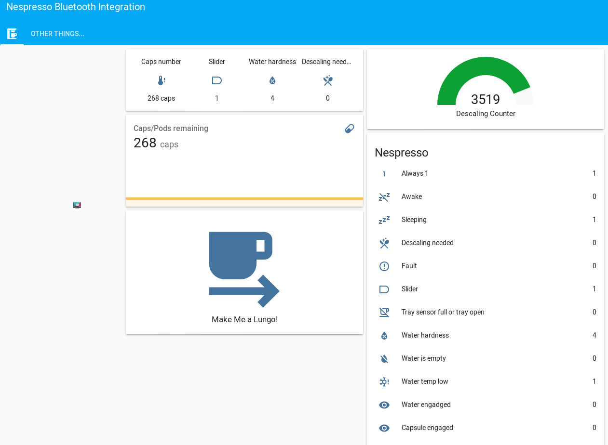

# nespresso

hassio support for Nespresso BLE coffee machine.



Much of the code to build this component was inspired by these projects:
* https://github.com/petergullberg/brewbutton
* https://github.com/custom-components/sensor.airthings_wave 

## Getting started

Download
```
/custom_components/nespresso/
```
into
```
<config directory>/custom_components/nespresso/
```
**Example configuration.yaml:**

```yaml
# Example configuration.yaml entry
sensor:
  - platform: nespresso
    mac: d2:12:f1:7b:cd:6d
    resource: 8287ee82593d3c4e
    scan_interval: 120
```
### Configuration Variables

**mac**

  (string)(Required) The nespresso machine mac address

**resource**

  (string)(Required) is the auth code that you must have catch with bluetooth sniffing the apps

**scan_interval**

  (string)(Optional) The interval between polls. Defaults to 300 seconds (5 minutes)


## Limitations

You must find the auth code from diffrerents way by yourself.

Bluez tool is required on host

```
apt install bluez
```

Only lungo coffee command for the moment

## Known Issues

* A lot

* Not tested on a D80

* No translations available yet


## Hardware Requirements

* An Nespresso Prodigio __OR__ Nespresso D80

* A Raspberry Pi 3/4 with built-in Bluetooth __OR__ a Bluetooth adapter that supports Bluetooth Low Energy (BLE). such as this
one: https://www.amazon.com/dp/B01N5MGEUS/ref=cm_sw_r_tw_dp_U_x_ObdNCb03P7QZJ

## Other Resources
* https://community.home-assistant.io/t/
nespresso-integration/127407